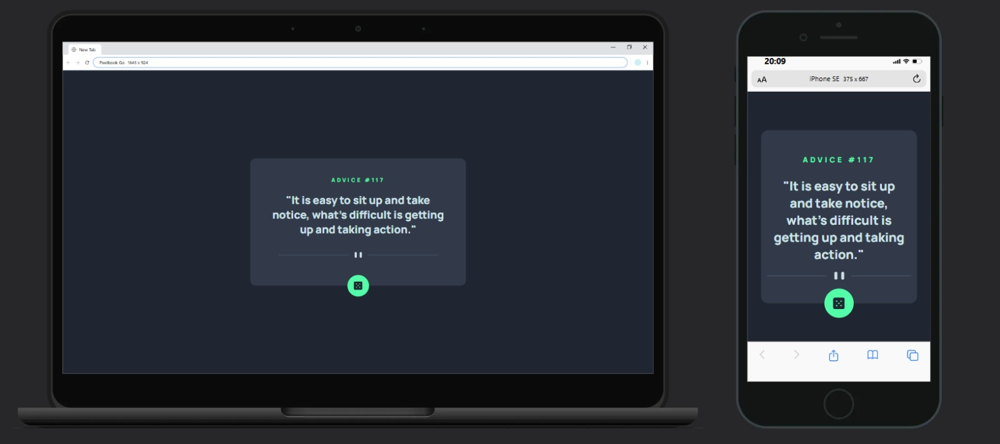

# 🚀 Replicando uma Página Web - Exercício DevQuest
## 👋 Apresentação

Olá! Me chamo Miguel e estou em minha jornada como aspirante a Desenvolvedor Web. Este projeto marca a minha segunda tentativa de replicar uma página web do zero, sem ajuda direta, e eu gostaria de compartilhar o processo com você.  
Escrevo este README como uma espécie de diário técnico, contando sobre o que aprendi, revisei e os desafios que enfrentei ao longo do caminho. Este desafio faz parte do módulo de CSS Avançado do curso DevQuest da Dev em Dobro. 🎯

## 💻 Explicação do Projeto

Este projeto é um Gerador de Conselhos, com um layout moderno e minimalista, projetado em HTML e CSS. A estrutura foca na apresentação de uma mensagem inspiradora ou "conselho" dentro de um cartão centralizado na tela.

**Elementos do layout:**

- 🟢 **Cabeçalho do conselho:** Exibe o título "ADVICE #..." seguido de um número único que identifica cada conselho, usando uma cor verde vibrante para destaque.
- 💬 **Texto do conselho:** Abaixo do título, encontramos uma citação motivacional centralizada, com uma fonte clara e fácil de ler, que se adapta bem ao fundo escuro.
- 🎲 **Botão de geração:** Logo abaixo da citação, um botão redondo verde, com um ícone de dado, está posicionado para chamar a atenção do usuário. Em um cenário funcional, esse botão acionaria a geração de um novo conselho ao ser clicado.

Embora, no momento, o foco deste desafio seja apenas replicar o layout, o projeto em si está preparado para ser dinâmico e interativo. Futuramente, quando eu estiver mais avançado no curso DevQuest, o desafio será fazer com que o botão gere conselhos ao ser clicado.

__⬇️ Confira o resultado final do projeto na imagem abaixo: ⬇️__

  

## 🛠️ Linguagens Utilizadas

 
  
  
  

## 🧗‍♂️ Desafios Enfrentados
Durante o desenvolvimento do projeto, enfrentei alguns desafios significativos. Um dos principais foi o posicionamento do botão gerador de conselhos, que exigiu várias tentativas até encontrar a melhor solução. Além disso, tive dificuldades em implementar efeitos de brilho e transição no botão (quando o cursor passava sobre ele), buscando torná-lo mais atraente visualmente. Também enfrentei desafios com a responsividade para telas menores que 610px e, infelizmente, não consegui aplicar essa funcionalidade sozinho. Fui ajudado por um colega do curso DevQuest, que me orientou a fazer as adaptações necessárias.

Apesar dessas dificuldades, consegui replicar a página sem recorrer à solução oficial. Posteriormente, comparei meu código com a solução fornecida e refinei algumas partes; contudo, confesso que a qualidade do código deste projeto ficou inferior à do desafio do Cartão de Perfil que fiz anteriormente. ✅

## 📚 O Que Aprendi com Este Desafio
Durante a execução deste exercício, pude aprimorar meu entendimento sobre várias propriedades CSS e suas aplicações práticas. Aprendi a alterar o espaçamento entre as letras utilizando a propriedade `letter-spacing`, o que ajudou a melhorar a legibilidade do texto em diferentes seções do projeto. Além disso, descobri como modificar o comportamento de quebra de um item flexível com as propriedades `max-width` e `word-wrap`, permitindo um layout mais responsivo e organizado.

Um dos destaques foi aprender a adicionar efeitos de brilho e transição a um elemento quando o cursor passa sobre ele, o que tornou a interação do usuário mais dinâmica e envolvente. Também revisei como posicionar elementos de maneira eficaz com a propriedade `position`, o que me permitiu criar um layout mais estruturado.

Além disso, aprimorei meu entendimento sobre Media Queries, permitindo que o site se adaptasse melhor a diferentes tamanhos de tela. Por fim, utilizei mais intensivamente a ferramenta Chrome DevTools, o que me ajudou a identificar e corrigir problemas de layout de forma mais eficiente. 🎨🔧

## 🎉 Conclusão
Se você chegou até aqui, agradeço por dedicar seu tempo para conhecer o meu diário técnico. Este 2° desafio foi um grande passo na minha jornada de aprendizado, e ainda há muito o que explorar e melhorar. 🙌

    
    

  

